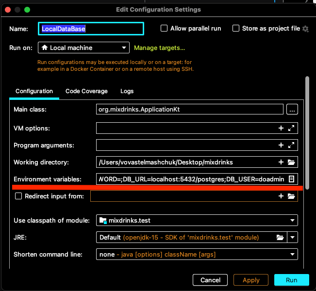

# The backend service for mixdrinks.org

### The API provides rest api about cocktails, receipts, goods and tools which your need to create the cocktails.

The service provide api for

* Cocktails
* Goods
* Tools
* Tags
* Filter by tags, goods, tools and cocktail name

### Using

[REST API](https://mixdrinks.github.io/backend/)

## Install & Run

The app require the postgres database. Run the postgres database and provide the following environment variables:

* DB_URL - the url to data, include `sslmode=require` if your install of database needs it.
* DB_USER - the username. The user must have read access to all database
* DB_PASSWORD - the password

### Deploy your own instance of service by digital ocean app platform

*Coming soon*

### Docker

The repository has DockerFile, the file create fully ready docker image.

### Run as java app

Clone project and install java.

Build jar file
`gradle shadowJar`

Copy jar file to root
`cp build/libs/*.jar ktor-docker-sample.jar`

Start a java app
`java -jar src/build/libs/*.jar`

### Application settings

The app can configure by resources/application.conf

## Development

- Clone the repo.
- Set up the local postgres database
- Add environment variable, DB_URL, DB_USER, DB_PASSWORD, Check [Install & Run](#install--run) for more details.

## Find a bug?

If you found an issue or would like to submit an improvement to this project, please submit an issue using the issues
tab above. If you would like to submit a PR with a fix, reference the issue you created!

### Visit our website

[Our website](https://mixdrinks.org/)

[Source of our website](https://github.com/MixDrinks/site)
